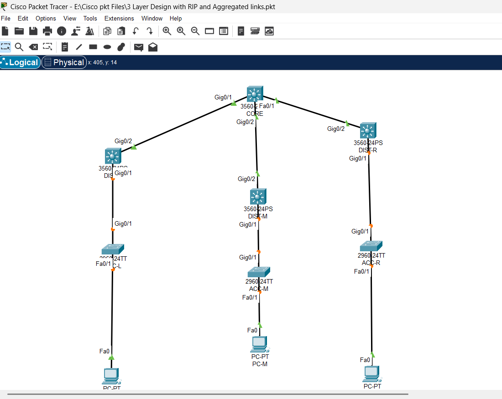

🌐 NetForge: 3-Tier Campus Network Design (RIP & Aggregated Links)

📌 Overview
This project demonstrates a scalable **3-tier campus network architecture** implemented in Cisco Packet Tracer. The design follows industry best practices using **Core, Distribution, and Access layers** to ensure modularity, performance, and reliability.

The network integrates **RIP routing protocol** and **aggregated links** to improve routing efficiency and redundancy.

🏗 Network Architecture

The topology is structured into three layers:

- **Core Layer**
  - High-speed backbone connecting distribution switches
  - Ensures fast and reliable data transfer across the network

- **Distribution Layer**
  - Layer 3 switches handling routing and policy control
  - Connects access layer to the core layer

- **Access Layer**
  - Provides connectivity to end devices (PCs)
  - Uses Layer 2 switches for local network access

⚙️ Key Features

- Implementation of **3-tier hierarchical network design**
- Configuration of **RIP (Routing Information Protocol)** for dynamic routing
- Use of **link aggregation concepts** to enhance bandwidth and redundancy
- Structured **IP addressing and subnetting**
- End-to-end connectivity across all network segments
- Scalable and modular design suitable for enterprise environments

🧠 Technologies & Concepts Used

- Routing & Switching
- RIP (Dynamic Routing Protocol)
- VLAN-ready architecture
- Subnetting and IP addressing
- Cisco Layer 2 & Layer 3 switching
- Network topology design

🛠 Tools Used

- Cisco Packet Tracer

📊 Network Scale

- **1 Core Layer Switch**
- **3 Distribution Layer Switches**
- **3 Access Layer Switches**
- **3 End Devices (PCs)**
- Multi-layer hierarchical topology

🔍 Verification & Testing

The following commands were used to validate the network:

show ip route
show ip protocols
ping between end devices

✔ Verified full connectivity across all layers  
✔ Confirmed proper routing table updates via RIP  

🖼 Network Topology

🎯 Objective

The objective of this project is to simulate a **real-world enterprise campus network**, focusing on:

- Layered network design
- Dynamic routing implementation
- Scalability and redundancy
- Efficient traffic flow across multiple layers

🚀 Learning Outcomes

- Gained hands-on experience in **enterprise network design**
- Understood implementation of **hierarchical architecture**
- Configured and verified **RIP routing protocol**
- Improved skills in **network troubleshooting and validation**

📂 Project Files

- `3 Layer Design with RIP and Aggregated links` → Cisco Packet Tracer file

