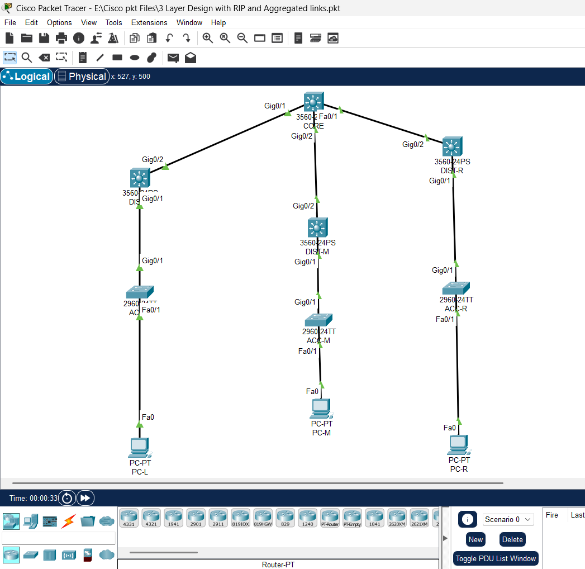
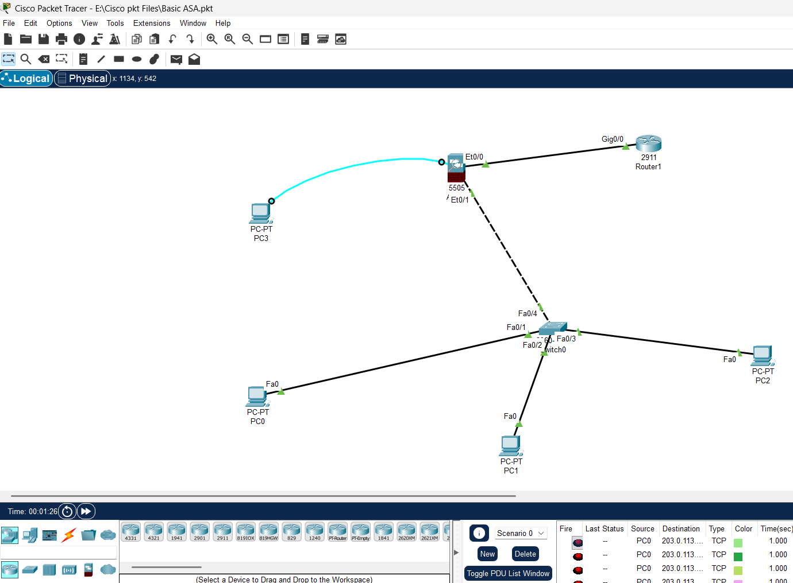
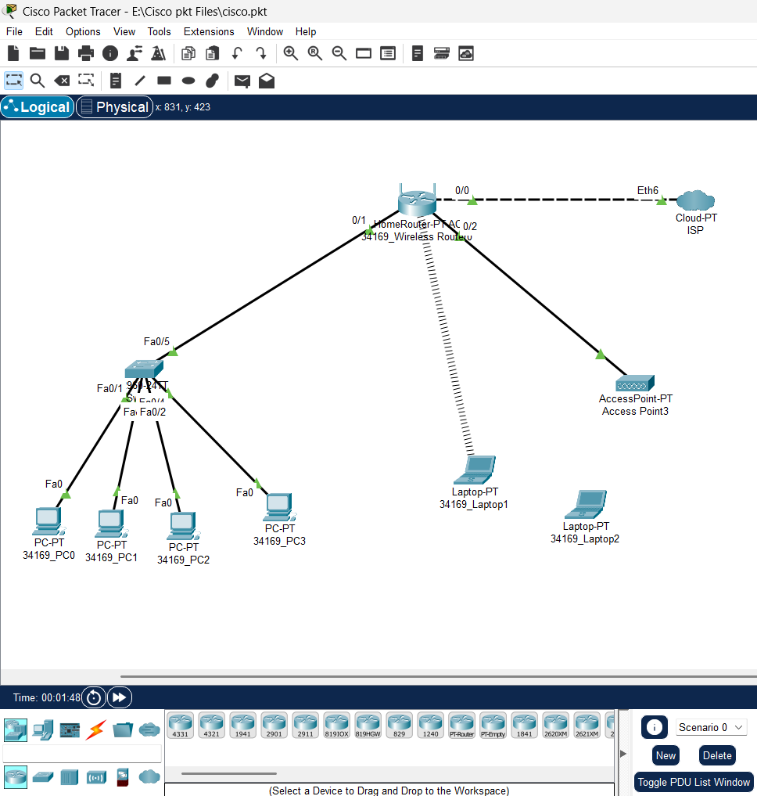
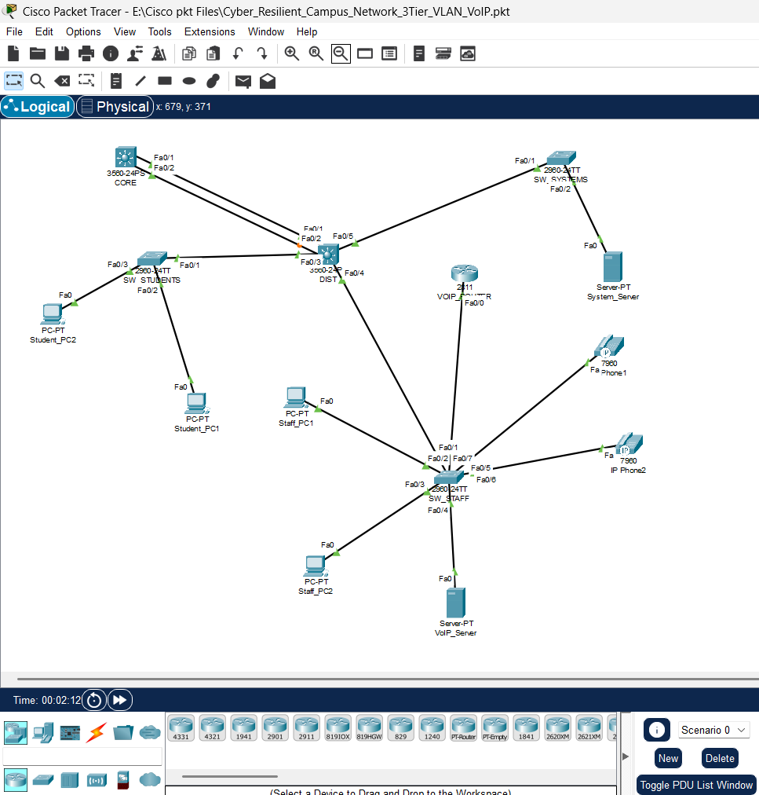

<h1 align="center">🌐 NetForge: Cisco Networks Labs</h1>

  <b>Enterprise Network Design | Routing | Switching | Security</b> 
  CCNA-Level Cisco Packet Tracer Projects

  
  
  
  

---

## 📌 Overview

This repository showcases a collection of hands-on **Cisco Packet Tracer labs** focused on real-world networking concepts, including **routing, switching, security, and enterprise network design**.

The projects simulate **enterprise-level environments** and demonstrate practical implementation of **CCNA-level skills**, including VLAN segmentation, routing protocols, firewall configuration, wireless networking, and VoIP integration.

---

## 🚀 What Makes This Portfolio Strong

- Designed **enterprise-grade network topologies**
- Implemented **3-tier architecture (Core, Distribution, Access)**
- Applied **dynamic routing protocols (RIP)**
- Configured **VLAN segmentation and inter-VLAN routing**
- Implemented **Cisco ASA firewall and ACL security rules**
- Integrated **VoIP and wireless networking**
- Verified networks using **industry-standard commands**

---

## 📂 Projects Overview

| Project | Description | Technologies |
|--------|------------|-------------|
| 3-Tier Campus Network | Scalable hierarchical network design | VLAN, RIP, Switching |
| Advanced Routing Topology | Multi-network routing implementation | RIP, Subnetting |
| ASA Firewall | Network security and traffic control | Cisco ASA, ACL |
| Wireless Network Topology | Internet + WiFi setup | Access Point |
| Cyber Resilient Campus Network 3Tier VLAN  (VoIP) | VLAN + VoIP enterprise design | VLAN, VoIP |

---

## 🧠 Key Concepts Covered

- VLAN Configuration & Segmentation  
- Inter-VLAN Routing  
- Static Routing & RIP  
- 3-Tier Network Architecture  
- Network Design & Topology  
- Cisco ASA Firewall & ACL  
- VoIP Network Integration  
- Wireless Networking  
- Network Troubleshooting  

---

## 🛠 Tools & Technologies

- Cisco Packet Tracer  
- Cisco Routers & Switches (2960, 3560, 2811, ASA 5505)  
- Linux CLI  

---

## 📊 Network Scale

Across all labs:

- **3+ Layer-3 switches (Core/Distribution)**  
- **Multiple Layer-2 access switches**  
- **15+ end devices (PCs, laptops, IP phones)**  
- **Routers, ASA firewall, servers, and wireless devices**  
- Multi-layer enterprise network architectures  

---

## 🔍 Verification Commands

show ip route
show ip protocols
show ip ospf neighbor
show vlan brief
ping
tracert

✔ Verified connectivity across all devices  
✔ Confirmed routing and VLAN operations  
✔ Ensured correct traffic flow  

---

## 🖼 Network Topologies

### 3-Tier Campus Network Topology

### Advanced Routing Topology

### ASA Firewall Network

### Wireless Network Topology

### Cyber-Resilient-Campus-Network-3Tier-VLAN(VoIP)

---

## 🎯 Objectives

- Build hands-on experience in **enterprise network design**
- Understand real-world **routing and switching implementation**
- Apply **network security principles**
- Design scalable and reliable networks
- Strengthen troubleshooting and verification skills  

---

## 📂 Repository Structure

..

netforge-cisco-networks-labs/
│
├── 3tier-campus-network/
├── advanced-routing-topology/
├── asa-firewall/
├── cyber-resilient-campus-network-3tier-VLAN-VoIP/
├── wireless-network/
└── README.md

