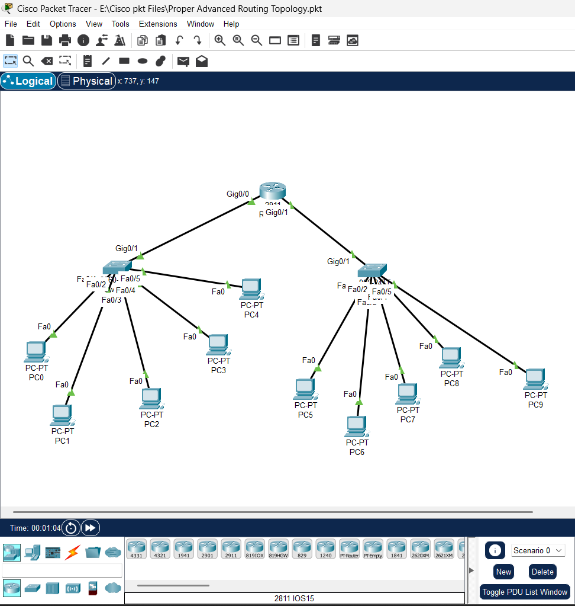

# 🌐 Advanced Routing Topology (RIP Implementation)

## 📌 Overview
This project demonstrates an advanced network topology using Cisco Packet Tracer, focusing on **routing between multiple networks**. The design includes routers and switches connecting multiple end devices, simulating real-world enterprise network communication.

The network uses **RIP (Routing Information Protocol)** to enable dynamic routing between different network segments.

---

## 🏗 Network Architecture

- A central **router (2811)** connecting multiple network segments  
- Two **switches** acting as access layers  
- Multiple PCs distributed across different networks  
- Multi-network communication is enabled through routing  

---

## ⚙️ Key Features

- Implementation of **dynamic routing using RIP**
- Multi-network communication across different subnets
- Structured network topology design
- End-to-end connectivity between all devices
- Scalable network layout for expansion

---

## 🧠 Technologies Used

- Cisco Packet Tracer  
- Routing (RIP Protocol)  
- Layer 2 Switching  
- IP Addressing & Subnetting  

---

## 📊 Network Details

- **1 Router (Cisco 2811)**
- **2 Switches**
- **10+ End Devices (PCs)**
- Multiple subnets connected via routing

---

show ip route
show ip protocols
ping
tracert

✔ Verified connectivity between all devices  
✔ Confirmed routing updates via RIP  
✔ Ensured proper communication across subnets  

---

## 🖼 Advanced Routing Network Topology

---

## 🎯 Objective

- Implement dynamic routing using RIP  
- Connect multiple networks using a router  
- Design a scalable network topology  
- Ensure full connectivity across subnets  

---

## 🚀 Learning Outcomes

- Understood routing between multiple networks  
- Configured RIP for dynamic routing  
- Designed and implemented a multi-network topology  
- Improved troubleshooting and verification skills  

---

## 📂 Project File

- `advanced-routing.pkt`

---

## 🔍 Verification Commands

